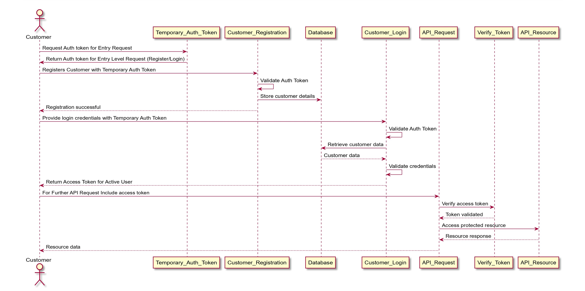

# Customer_Registration-Login_Security_Token
This project is an application built using the Spring Boot framework. It provides a secure and efficient solution for customer registration and login functionality. The primary objective of this project is to demonstrate the integration of Spring Boot, database connectivity, and Spring Security. 

# Sequence Diagram

## Functionality
The project offers the following key functionalities:

- Temporary Auth token generation for register and login request.

- Customer Registration: Users can create new accounts by providing their necessary details, such as username, email address, and password. The application securely stores the customer information in a connected database.

- Customer Login: Registered customers can securely log in to their accounts using their credentials. The login process includes authentication and authorization mechanisms to ensure the security of user data.

- Token-based Authentication: The project implements token-based authentication using Spring Security. Upon successful login, customers receive an access token, which they can use for subsequent API requests. This authentication mechanism enhances the security of the application.

- Database Connectivity: The project establishes a connection with a database, allowing the storage and retrieval of customer information. The chosen database technology depends on the project's configuration and requirements.

The Customer_Registration-Login_Security_Token project aims to serve as a foundation for developers looking to implement customer registration and login functionality in their Spring Boot applications while incorporating robust security measures. It provides a solid starting point for building secure and scalable customer-centric applications.

## Contributing

After successful login you can generate a session for user and store it into database for further validation with the JWT token.

